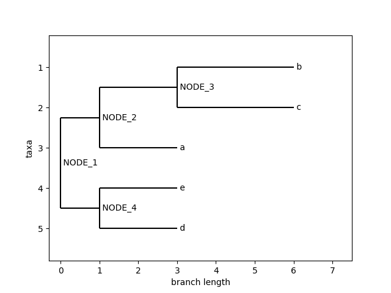

# MultiTreeKnit.jl
Extension of the julia package TreeKnit for inference of Ancestral Reassortment Graphs of multiple segments, the goal is to extend the package [TreeKnit](https://pierrebarrat.github.io/TreeKnit.jl), which performs inference of Ancestral Reassortment Graphs for segmented genomes (typically, human influenza) using two segment trees to a multiple segments. This is important as influenza is comprised of 8 segments and thus enabling the inference of ARGs between all segments could be useful in understanding influenza evolution processes. 

This folder just contains code for running a benchmark version of multi-tree TreeKnit. 
In this approach trees (with the same leaves) are given as input in a specific order and this is the order used to resolve polytomies and infer MCCs. The order that pairs are resolved in is shown in the picture below 

Here T_{1,2} corresponds to resolving trees 1 and 2 using each other and then generating a list of MCCs using TreeKnit, these resolved trees are then used to calculate the MCCs of the next neighboring tree pairs (which are connected by arrows). This means that after calculating the MCCs for tree 1 and tree 2 and resolving their polytomies using each other, instead of using the original tree 1 the resolved tree 1 is then further used when calculating the MCCs between tree 1 and tree 3. 

We also introduce the `ARGPlots` functionality to view pairwise ARGs from the point of view of one chosen tree.

## ARGPlots
Functionality to plot ancestral recombination graphs using MCCs and resolved trees generated in TreeKnit.

Assume the phylogenetic trees of multiple segmented genomes have been infered (these need the same terminal nodes) and all tree have been resolved in a compatible manner. A main tree can be chosen to view the ancestral history and recombination events of all other segments using the output generated by [TreeKnit](https://pierrebarrat.github.io/TreeKnit.jl). Given a list of resolved trees and their MCCs with the main tree (see output of `TreeKnit`) this function will plot the recombination sites as seen from the first tree. For example given two trees: 

 
 

The output ARG, as seen from tree1 is

The dashed line between recombination sites can be removed by setting the `draw_connections` argument to `False`. 
