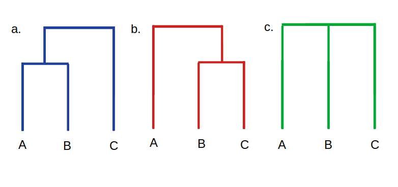

# [MultiTreeKnit] (@id multitreeknit)

`TreeKnit` can be used to infer reassortment events between multiple tree pairs. When reassortment events between three or more trees should be inferred, `TreeKnit` uses a recursive inference strategy to:
- resolve each tree using information from all other trees in a consistent manner,
- identify shared regions of each tree pair (MCCs),
- find reassortment events between tree pairs.
The following example illustrates the benefits of this inference strategy over running `TreeKnit` individually on all tree pairs. Note however, that MultiTreeKnit may still return MCCs that are inconsistent with each other, which prevents the construction of an ARG. Therefore, we do not reconstruct an ARG for more than two trees. 

In the overview section, we described [two versions of `TreeKnit`](@ref TK_method_options), differing by the number of inference rounds. The first version, the `:better_trees` method is the default method for $K>2$ trees. It has been optimized for using multiple reassorting segments to infer parameters of pathogen evolution. We optimized for sensitivity in MCC inference and polytomy resolution, minimizing the false positive rate for shared branches and new splits, but increasing the false negative rate, i.e. typically inferring too many reassortment events. 

In the following section we shall explain the differences between the two methods, using a three tree example.  

## MultiTreeKnit Example


The figure shows an ARG, of three tree segments, marked by their respective colors. The real MCCs of the trees are visible on the lower right. Mutations on the tree segments are marked with diamonds, the 2. segment has less mutations and is thus not fully resolved. 

### The `--better-trees` method

1. All trees are compatibly pre-resolved with each other (this can be deactivated with the `--no-pre-resolve` flag). In this case no additional splits can be added. For example, we try to add the $(B, C)$ and the $(A, B, C)$ into `tree_2` but as the two splits are not compatible with `tree_3` they will not be introduced.
2. Run `1` round of standard `TreeKnit` without resolution on all tree pairs. As trees are not further resolved this can be fully parallelized. Note that $MCC_{\{1,2\}}$ and $MCC_{\{1,3\}}$ will not be properly inferred without resolution. Potential inferred $MCC_{\{1,2\}}$ are:
$$ MCC'_{\{1,2\}} = \{\{A\}, \{D\}, \{B, C, D, E\}\} $$
$$ MCC'_{\{1,2\}} = \{\{B\}, \{D\}, \{A, C, D, E\}\} $$
$$ MCC'_{\{1,2\}} = \{\{C\}, \{D\}, \{A, B, D, E\}\} $$
3. Ladderize the first tree and sort all polytomies according to to this tree to allow for visualization as a tanglegram. 

In this example the trees will not be further resolved, leading to no inaccurate splits being introduced.

### The `--better-MCCs` method

1. All trees are compatibly pre-resolved with each other (this can be deactivated with the `--no-pre-resolve` flag). As before no additional splits can be added.
2. Run `1` round of standard `TreeKnit` with strict resolution on all tree pairs. As trees are further resolved this must be done in a specific ordering and can only be partially parallelized (see [consistent resolution](@ref consistent_resolution)). As we choose the input order of trees as the order to compute MCCs and resolve trees in we first compute $MCC_{\{1,2\}}$, then $MCC_{\{1,3\}}$ and lastly $MCC_{\{2, 3\}}$. 
- If the SA converges we will infer the correct MCC for $MCC_{\{1,2\}}$. Note the $(B, C)$ and the $(A, B, C)$ split will not be added as we are using strict resolution and the order of the reassortment and the recombination event cannot be determined from trees. I.e. as $D$ is in a different location in `tree_1` its location in `tree_2` cannot be inferred from `tree_1`, and the splits $(B, C, D)$ and $(A, B, C, D)$ as well as the splits $(B, C)$, $(B, C, D)$ and $(A, B, C, D)$ are also possible. This is what we refer to as an ambiguous split. 
- If the SA converges we shall infer the correct $MCC_{\{1,3\}}$
- We then compute $MCC_{\{2,3\}}$, if the SA converges we will infer $MCC_{\{1,3\}} = \{\{E\}, \{A, B, C, D\}\} $
there is only one way to resolve `tree_2` to have such an MCC with `tree_3` and we will introduce the splits $(A, B)$ and $(C, D)$ in `tree_2`. 
3. Run a second round of pair-wise `TreeKnit` without resolution, this is required to make sure that all output MCCs are actually MCCs. Note for example that $MCC_{\{1,3\}}$ is no longer an MCC now that `tree_2` has been further resolved. Not only are the MCCs less accurate in this example, we have added incorrect splits to `tree_2`. (Note that if `tree_2` still had the $(A, B, C)$ split this approach would have potentially correctly resolved trees and inferred the correct MCCs, however on average the first approach outperforms this approach). A potential MCC output for this example would be:
$$MCC'_{\{1,2\}} = \{\{C\}, \{D\}, \{A, B, E\}\}$$
$$MCC'_{\{1,3\}} = \{\{E\}, \{A, B, C, D, E\}\}$$
$$MCC'_{\{2,3\}} = \{\{C\}, \{D\}, \{A, B, D, E\}\}$$ 
4. Ladderize the first tree and sort all polytomies according to to this tree to allow for visualization as a tanglegram.


## Consistent resolution (@id consistent_resolution)



When `TreeKnit` is run individually on all tree pairs trees could be resolved inconsistently. By default `TreeKnit` resolves trees when searching for reassortment events, this is especially important for influenza where resolution is often low and not resolving trees can lead to much higher rates of reassortment being inferred. 

We explore the small example, seen above. First let us look at what would happen if standard pair-wise `TreeKnit` was run on all tree pairs with resolution. When the MCCs of `tree a` and `tree c` are computed no reassortment events would be found as `tree c` would be resolved according to `tree a` (i.e. a branch would be introduced above leaves `A` and `B`). However, when the MCCs of `tree b` and `tree c` are computed `tree c` would be resolved according to `tree b` and a branch would be introduced above leaves `B` and `C`. These two different resolutions of `tree c` are incompatible with each other and do not allow us to use this reassortment event information together.

In our default version of `TreeKnit`, the so called `:better_trees` method, we would first try to pre-resolve all trees using each other. In this case, as the $(A, B)$ and the $(B, C)$ split are not compatible, we do not know which to introduce into `tree c` and thus we would not introduce any new splits. We would then compute all MCC-pairs without resolution, which would mean inferring reassortment events between all trees. 

The other approach would be to choose to resolve `tree c` with `tree a` OR with `tree b`, inferring less reassortment events, which is more likely to be true. However, we have no information which tree we should used to resolve `tree c`.If we use the `:better_MCCs` method of `TreeKnit`, `TreeKnit` will perform `2` rounds of inference, resolving trees using tree order in the first round of inference. The order that pairs are resolved in is shown in the picture below 


Here $T_{1,2}$ corresponds running pair-wise `TreeKnit` with the `resolve=true` flag and outputting the resolved `tree 1` and `tree 2`. These resolved trees are then used to calculate the MCCs of the next neighboring tree pairs (which are connected by arrows). This means that after calculating the MCCs for `tree 1` and `tree 2` and resolving their polytomies using each other, instead of using the original `tree 1` the `resolved tree 1` is then further used when calculating the MCCs between `tree 1` and `tree 3`. Leading to a consistent tree resolution.

Furthermore, we use [strict resolution](@ref resolve_strict_vs_liberal) when resolving trees with MultiTreeKnit. Strict resolve will only resolve polytomies if the location of each branch in the new split can be fully determined by the other tree. Using strict resolve prevents the introduction of incorrect splits into the trees, this is especially important when resolved trees are used downstream for inference as these splits could prevent the simulated annealing from converging. 

At the end of the sequential inference on all tree pairs, each tree will be resolved as much as possible using each other tree. However, the output MCCs might not be consistent with each other and might not fulfill the necessary transitivity requirements to create an ARG (see [consistent MCCs](@ref consistent_MCCs)). 

Furthermore, it can occur that the MCCs inferred for the tree pairs that were calculated at the start of the round are no longer MCCs (see the example above). We prevent this from happening, and make sure that all MCCs that are inferred are actual MCCs by running a final round where we re-infer all tree pair MCCs without resolving trees. However, the MCCs might still not fulfill all necessary consistency conditions to produce an ARG.

## Consistent MCCs (@id consistent_MCCs)


When `TreeKnit` is run individually on all tree pairs the final MCCs might be inconsistent with each other. 
As can be seen in the example when `TreeKnit` is run on these tree pairs individually not only are the trees resolved in an incompatible manner the transitivity of the MCCs is also broken. Let us explore the same example from before, seen above. If no reassortment has occurred between leaves `A` and `B` in `tree a` and `tree c` and no reassortment has occurred between these leaves in `tree b` and `tree c`, reassortment cannot have occurred between `A` and `B` in `tree a` and `tree b`. However, there has clearly been a reassortment event between trees `tree a` and `tree b`. 

However, fixing resolution issues as described above does not necessarily fix transitivity. `TreeKnit` uses simulated annealing and removes branches at random. This means that even if `tree c` is now resolved according to `tree a` and we infer that a reassortment event has happened between trees `tree a` and `tree b` as well as between trees `tree c` and `tree b` the MCCs that `TreeKnit` infers might be inconsistent with each other. For example look at the following MCCs:
```
{ 
    "MCC_dict" : {
        "1": { 
            "trees":["a", "b"],
            "mccs": [["A"],["B","C"]]
            },
        "2": { 
            "trees":["a", "c"],
            "mccs": [["A","B","C"]]
            },
        "3": { 
            "trees":["b", "c"],
            "mccs": [["A","B"],["C"]]
        }
    }
}
```
These MCCs show that no reassortment has occurred between leaves `B` and `C` in `tree a` and `tree b` and no reassortment has occurred between these leaves in `tree_a` and `tree_c`. Thus, for transitivity to hold reassortment cannot have occurred between `B` and `C` in `tree b` and `tree c`. But this is not the case.
Such inconsistencies make it impossible to visualize an ARG. Currently, we are not able to fully fix such incompatibilities. 

## Parallel MultiTreeKnit

For 3 or more trees the `--parallel` flag can be used to run `TreeKnit` in parallel. When the `:better_trees` method is used and MCCs are inferred for tree pairs without further resolving trees, we can fully parallelize all calls of standard pair-wise `TreeKnit` on all $\frac{K(K-1)}{2}$ tree pairs (where $K$ is the number of trees). However, when the `:better_MCCs` method is applied and trees are additionally resolved in the first round of pair-wise `TreeKnit`, an ordering of jobs is required. This ordering can be easily determined from the recursive order graph. By running trees in parallel we can improve run time from order $K^2$ to $K$, where $K$ is the number of trees.

 

For example, in order to compute the MCCs of `tree 1` and `tree 4` or $T_{1,4}$ we must have calculated $T_{1,2}$ and $T_{1,3}$. In order to compute the MCCs of `tree 2` and `tree 3` we also need $T_{1,2}$ and $T_{1,3}$ but we do not need to know $T_{1,4}$. Thus, $T_{1,4}$ and $T_{2,3}$ can be calculated at the same time, $T_{2,4}$ must wait for $T_{1,4}$ and $T_{2,3}$ to finish, and $T_{3,4}$ must in turn wait for $T_{2,4}$. Thus, the arrows in the recursive order graph also determine the work flow in parallel computing. As can be seen the longest path is from $T_{1,2}$ to $T_{1,4}$ and then down to $T_{3,4}$, and is of length $2K - 2$, whereas there are a total of $\frac{K(K-1)}{2}$ pairs which would mean a quadratic runtime without parallelization. 

Per default the `--parallel` flag is set to false to avoid potential platform issues. When using `TreeKnit` on a larger computing cluster it is best practice to set the desired number of cluster nodes to 1, and cpu number on that node as high as desired. 
