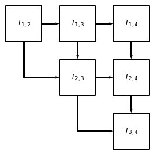

# [MultiTreeKnit] (@id multitreeknit)

`TreeKnit` can be used to infer recombination events between multiple tree pairs. When recombination events between three or more trees should be inferred `TreeKnit` uses a recursive inference strategy to return consistently resolved trees which we call `MultiTreeKnit`. The following example illustrates the benefits of this inference strategy over running `TreeKnit` individually on all tree pairs. 

As we shall show this recursive strategy makes sure that:
- Trees are resolved in a consistent manner and cannot be resolved differently between different tree pairs. This allows us to use all recombination event information together.
- MCCs are resolved in a consistent manner. Recombination is transitive. If no recombination has occurred between leaves `A` and `B` in `tree a` and `tree b` and no recombination has occurred between these leaves in `tree a` and `tree c`, recombination cannot have occurred between `A` and `B` in `tree b` and `tree c`. If MCCs of different tree pairs are not consistent they cannot be visualized in an ARG. 


## Consistent Resolution

When `TreeKnit` is run individually on all tree pairs trees could be resolved inconsistently. By default `TreeKnit` resolves trees when searching for recombination events, this is especially important for influenza where resolution is often low and not resolving trees can lead to much higher rates of recombination being inferred. 

For the example above this would mean that when the MCCs of `tree a` and `tree c` are computed no recombination events would be found as `tree c` would be resolved according to `tree a` (i.e. a branch would be introduced above leaves `A` and `B`). However, when the MCCs of `tree b` and `tree c` are computed `tree c` would be resolved according to `tree b` and a branch would be introduced above leaves `B` and `C`. These two different resolutions of `tree c` are incompatible with each other and do not allow us to use this recombination event information together.

To avoid inconsistent resolution, the tree order is used to resolve tree polytomies consistently and infer MCCs. The order that pairs are resolved in is shown in the picture below 



Here $T_{1,2}$ corresponds to resolving `tree 1` and `tree 2` using each other and then generating a list of MCCs using standard `TreeKnit`. These resolved trees are then used to calculate the MCCs of the next neighboring tree pairs (which are connected by arrows). This means that after calculating the MCCs for `tree 1` and `tree 2` and resolving their polytomies using each other, instead of using the original `tree 1` the `resolved tree 1` is then further used when calculating the MCCs between `tree 1` and `tree 3`. 

Note that even if the `resolved tree 1` is further resolved with `tree 3` the MCCs found between `tree 1` and `tree 2` will still hold for this twice resolved `tree 1`.

## Consistent MCCs

When `TreeKnit` is run individually on all tree pairs trees the final MCCs might be inconsistent with each other. 
As can be seen in the example when `TreeKnit` is run on these tree pairs individually not only are the trees resolved in an incompatible manner the transitivity of the MCCs is also broken. If no recombination has occurred between leaves `A` and `B` in `tree a` and `tree c` and no recombination has occurred between these leaves in `tree b` and `tree c`, recombination cannot have occurred between `A` and `B` in `tree a` and `tree b`. However, there has clearly been a recombination event between trees `tree a` and `tree b`. 

However, fixing resolution issues as described above does not necessarily fix transitivity. `TreeKnit` uses simulated annealing and removes branches at random. This means that even if `tree c` is now resolved according to `tree a` and we infer that a recombination event has happened between trees `tree a` and `tree b` as well as between trees `tree c` and `tree b` the MCCs that `TreeKnit` infers might be inconsistent with each other. For example look at the following MCCs:
```
{ 
    "MCC_dict" : {
        "1": { 
            "trees":["a", "b"],
            "mccs": [["A"],["B","C"]]
            },
        "2": { 
            "trees":["a", "c"],
            "mccs": [["A","B","C"]]
            },
        "3": { 
            "trees":["b", "c"],
            "mccs": [["A","B"],["C"]]
        }
    }
}
```
These MCCs show that no recombination has occurred between leaves `B` and `C` in `tree a` and `tree b` and no recombination has occurred between these leaves in `tree_a` and `tree_c`. Thus, for transitivity to hold recombination cannot have occurred between `B` and `C` in `tree b` and `tree c`. But this is not the case.
Such inconsistencies make it impossible to visualize an ARG.

To avoid inconsistent MCCs we use two approaches in `MultiTreeKnit`:
- we give previously inferred MCCs as a constraint to the simulated annealing. For example, assume that in `tree a` and `tree b` as well as in `tree a` and `tree c` the leaves `B` and `C` were both found to be in an MCC together and no recombination event to have occurred between them. The branches between leaves `B` and `C` are marked as shared in trees `tree b` and `tree c` and their removal is assigned a higher cost (`oa.constraint_cost `$= 2*\gamma$) than removing a node that is not on a shared branch. In this manner we push the simulated annealing to find MCCs between `tree b` and `tree c` that are consistent with the other MCCs, however we still enable it to split such branches if it leads to a more optimal energy cost if, for example, the previously inferred MCCs were inaccurate. 
- by default we run two rounds of `MultiTreeKnit`. In the first round the initial tree pairs have no constraints but in the second round they also have constraints from other tree pairs, enabling optimal information transfer. 

However, even using these approaches MCCs may still inconsistent as simulated annealing is a stochastic process. Inconsistent MCCs cannot be viewed together in a ARG. Therefore, if an ARG of all trees is desired the `--force-consist` flag can be used to make all MCCs consistent with each other, this is done by splitting MCCs in a way that is compatible with tree topology and fixes transitivity. In the case of the inconsistent MCCs above this would be accomplished by splitting the MCC between `tree a` and `tree c` from `[["A", "B", "C"]]` into `[["A"], ["B", "C"]]`.

## Parallel MultiTreeKnit

For 4 or more trees the `--parallel` flag can be used to run `MultiTreeKnit` in parallel. For example, in order to compute the MCCs of `tree 1` and `tree 4` or $T_{1,4}$ we must have calculated $T_{1,2}$ and $T_{1,3}$. In order to compute the MCCs of `tree 2` and `tree 3` we also need $T_{1,2}$ and $T_{1,3}$ but we do not need to know $T_{1,4}$. Thus, $T_{1,4}$ and $T_{2,3}$ can be calculated at the same time, $T_{2,4}$ must wait for $T_{1,4}$ and $T_{2,3}$ to finish, and $T_{3,4}$ must in turn wait for $T_{2,4}$.


